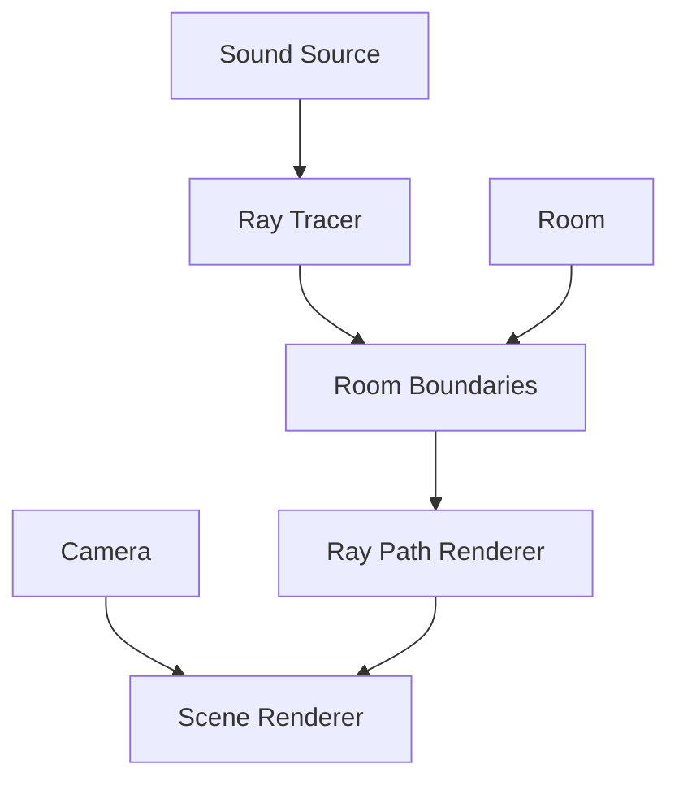

# Architecture Documentation

## System Overview

```
spatialAudio/
├── src/
│   ├── room/              # Room and boundary management
│   ├── sound/             # Sound and ray tracing
│   ├── visualization/     # Rendering and display
│   ├── camera/            # Camera controls
│   ├── ui/                # User interface
│   ├── core/              # Core WebGPU setup
│   ├── types/            # TypeScript definitions
│   └── shaders/          # WGSL shader files
└── docs/                 # Documentation
```

## Component Architecture

### 1. Core Components

#### Room System
- `Room`: Main room management and rendering
- `RoomBoundaries`: Geometric boundaries and intersection testing
- `RoomControls`: UI for room configuration

#### Sound System
- `SoundSource`: Sound source management
- `RayTracer`: Ray tracing and energy calculations
- `RayPathRenderer`: Ray visualization

#### Visualization
- `Camera`: View control and navigation
- `RayPathRenderer`: Path visualization
- `RoomRenderer`: Room geometry display

### 2. Data Flow



## Key Systems

### 1. Ray Tracing System
```typescript
interface RayTracerConfig {
    numRays: number;      // Default: 1000
    maxBounces: number;   // Default: 10
    minEnergy: number;    // Default: 0.01
}
```

#### Ray Path Generation
1. Sound source emits rays
2. Ray-boundary intersection tests
3. Energy calculations
4. Reflection computation
5. Path visualization

### 2. Room System
```typescript
interface RoomConfig {
    dimensions: RoomDimensions;
    materials: RoomMaterials;
}
```

#### Boundary Management
- Plane equations for walls
- Intersection testing
- Material properties
- Dynamic updates

### 3. Visualization System
```typescript
interface RenderConfig {
    device: GPUDevice;
    format: GPUTextureFormat;
    size: { width: number; height: number };
}
```

#### Render Pipeline
1. Room geometry
2. Ray paths with energy
3. Sound source
4. UI elements

## Implementation Details

### 1. WebGPU Integration

#### Buffer Management
```typescript
interface BufferLayout {
    vertices: Float32Array;
    indices: Uint16Array;
    uniforms: Float32Array;
}
```

#### Shader Structure
```wgsl
struct VertexInput {
    @location(0) position: vec3<f32>,
    @location(1) normal: vec3<f32>
}

struct Uniforms {
    viewProjection: mat4x4<f32>,
    modelMatrix: mat4x4<f32>
}
```

### 2. Performance Optimizations

#### Ray Tracing
- Early termination
- Efficient intersection tests
- Vector normalization
- Self-intersection prevention

#### Rendering
- Instanced drawing
- Uniform buffers
- Compute shaders
- Double buffering

### 3. State Management

#### Room State
```typescript
interface RoomState {
    dimensions: vec3;
    materials: MaterialProperties[];
    boundaries: Plane[];
}
```

#### Ray State
```typescript
interface RayState {
    paths: vec3[][];
    energies: number[];
    bounces: number[];
}
```

## Communication Flow

### 1. User Interaction
1. UI Controls → State Update
2. State Update → Room/Source Update
3. Update → Ray Recalculation
4. Recalculation → Visualization

### 2. Ray Processing
1. Source → Ray Generation
2. Ray → Boundary Testing
3. Boundary → Reflection
4. Reflection → Energy Update
5. Update → Visualization

## Future Architecture

### 1. Planned Enhancements
- Audio processing pipeline
- Real-time auralization
- Multiple source support
- Advanced room geometries

### 2. Scalability
- Compute shader optimization
- Worker thread processing
- Dynamic LOD for visualization
- Memory management

## Best Practices

### 1. Code Organization
- Component-based structure
- Clear separation of concerns
- TypeScript for type safety
- Documentation mirroring code

### 2. Performance
- GPU-first approach
- Efficient data structures
- Minimal state changes
- Cached calculations

### 3. Maintainability
- Clear interfaces
- Unit tests
- Documentation
- Code reviews
