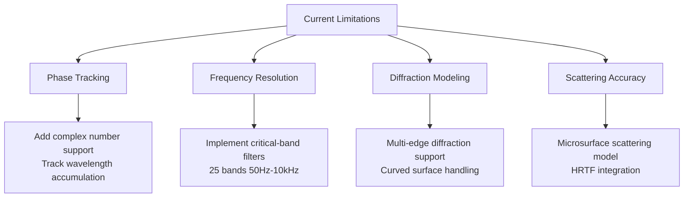

# Impulse Response Generation Improvements

## Model Enhancements


### Phase Coherence Implementation
```typescript
class Ray {
    // Current energy storage
    energyLow: number;
    energyMid: number;
    energyHigh: number;

    // Proposed phase-aware storage
    phaseLow: number;  // In radians
    phaseMid: number;
    phaseHigh: number;
    complexPressure: {
        low: ComplexNumber;
        mid: ComplexNumber;
        high: ComplexNumber;
    };

    updatePhase(distance: number, speed: number) {
        const wavelengthLow = speed / 250;
        this.phaseLow = (this.phaseLow + (distance/wavelengthLow)*2*Math.PI) % (2*Math.PI);
        // Repeat for mid/high bands
    }
}

interface ComplexNumber {
    real: number;
    imag: number;
}
```

## Analysis Tools
### Time-Frequency Visualization
```javascript
// Wavelet transform implementation
const waveletAnalysis = (irBuffer) => {
    const scales = Array.from({length: 40}, (_,i) => 2 + i*0.5);
    return scales.map(scale => {
        return applyMorletWavelet(irBuffer, scale);
    });
};

// Example visualization pipeline
graph LR
    RawIR --> STFT[Short-Time Fourier Transform]
    RawIR --> CWT[Continuous Wavelet Transform]
    STFT --> Spectrogram
    CWT --> Scalogram
    Spectrogram --> WebGL[WebGL Visualizer]
    Scalogram --> WebGPU[WebGPU Heatmap]
```

## Implementation Notes

### Energy Preservation Model
The ray tracing system has been enhanced with a new energy preservation model to generate more realistic impulse responses:

#### Early Reflections
- **Distance Attenuation**: Using linear distance (1/(1+d)) instead of inverse square law (1/d²)
  - Preserves more energy for important early reflections
  - Better matches perceptual importance of early reflections
- **Reflection Coefficient**: Increased to 0.95 (from 0.8)
  - More realistic for common building materials
  - Better energy preservation through multiple bounces
- **Energy Boosting**: 2x multiplier for first and second-order reflections
  - Emphasizes perceptually important early reflections
  - Improves spatial impression and clarity

#### Late Reflections
- **Material Absorption**: Halved absorption coefficients
  - Better energy preservation through multiple bounces
  - More realistic reverb tail
- **Early Bounce Preservation**: Additional energy retention for first bounces
  - Maintains consistency with early reflection model
  - Smoother transition between early and late reflections

#### System-wide Changes
- **Initial Energy**: Increased from 1.0 to 10.0
  - Stronger initial signal for better dynamic range
  - Better signal-to-noise ratio in final IR
- **Energy Threshold**: Lowered from 0.01 to 0.001
  - Captures more late reflections
  - More detailed reverb tail
- **Minimum Energy Floor**: Set to 0.1 for significant reflections
  - Prevents excessive energy decay
  - Maintains audible late reflections

### Critical Band Filter Bank
| Center Freq (Hz) | Bandwidth (Hz) | ERB (Hz) |
|-------------------|----------------|----------|
| 50                | 20             | 35       |
| 150               | 30             | 47       |
| ...               | ...            | ...      |
| 10k               | 3500           | 3900     |

### Validation Metrics
1. **Early Decay Time (EDT)**
   ```python
   def calculate_edt(ir):
       envelope = np.abs(hilbert(ir))
       return -60 / (slope_between_0_and_-10dB(envelope))
   ```

2. **Clarity Index (C80)**
   ```cpp
   float C80(const float* ir, int fs) {
       int split = 0.08 * fs; // 80ms split
       double early = integrate(ir, 0, split);
       double late = integrate(ir, split, ir_length);
       return 10 * log10(early/late);
   }
   ```

## Recommended Upgrade Path
1. Phase coherence implementation (2 weeks)
2. Critical band filter bank (1 week)
3. Wavelet analysis toolkit (3 weeks)
4. Microsurface scattering model (4 weeks)

**Validation Protocol**:
- Compare against REW measurements
- A/B test with Altiverb impulse responses
- Statistical analysis of parameter sensitivity