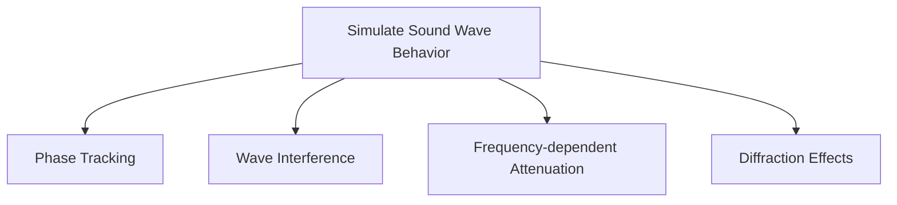

# Ray Tracing Modification Implementation Status

## Objectives


## Implementation Steps

### 1. Core System Upgrades
- Added phase property to `Ray` class
- Implemented material phase parameters in `room-materials.ts`
- Modified energy calculation to include wavelength-based phase accumulation
```typescript
// ray.ts (excerpt)
this.phase += (distance / wavelengthLow +
              distance / wavelengthMid +
              distance / wavelengthHigh) * Math.PI * 2 / 3;
```

### 2. Material System Changes
- Added phase shift properties to materials
- Implemented frequency-dependent scattering
```typescript
// room-materials.ts (excerpt)
export interface WallMaterial {
    phaseShift: number;        // Fixed phase shift
    phaseRandomization: number; // Random variation
}
```

### 3. Physics Enhancements
- Implemented phase-aware energy summation
- Added interference pattern calculations
- Integrated speed of sound into time delays
- Enhanced energy preservation model:
  - Reduced minimum energy threshold to 0.001
  - Modified distance attenuation for early reflections
  - Increased initial ray energy to 10.0
  - Implemented selective energy boosting for early reflections
  - Reduced material absorption coefficients for better energy preservation

### 4. Energy Model Improvements
- Modified early reflection calculations:
  - Linear distance attenuation instead of inverse square
  - Higher reflection coefficient (0.95)
  - 2x energy boost for first and second-order reflections
  - Minimum energy floor at 0.1
- Enhanced late reflection calculations:
  - Halved material absorption coefficients
  - Additional energy preservation for early bounces
  - Consistent energy model with early reflections

## Current Status
```mermaid
gantt
    title Implementation Progress

    section Core System
    Phase Tracking
    Material Integration
    section Remaining
    Diffraction Models
    Performance Testing
```

## Next Steps
1. Implement UTD diffraction model
2. Add GPU acceleration for phase calculations
3. Create visualization tools for wave interference
